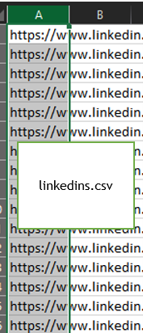
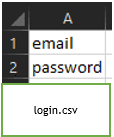
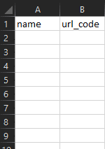

# scrape-linkedin-company-for-connections

## Libraries Used
1. Selenium 
2. webdriver_manager
3. Beautifulsoup4
4. pandas
5. lxml
6. Pathlib
`pip install selenium webdriver_manager beautifulsoup4 pandas lxml pathlib`

## Data Requirements
Company linkedin profile should minimally be valid with Industry, Country, Num of Employees, and connections

## Supported functionalities
1. Industry appears in industry.csv - None types appear as No Industry Found
2. Same for country - country.csv
3. Same for Num of employees - employees.csv
4. Connections of desired employees - connections.csv

## User Guide
1. Store your linkedin profiles in a linkedins.csv file (An example is set below)
2. Save it in the same directory as all the program files
3. The output csv files will be found in the results folder
4. Fill in your linkedin login details in login_details.py

## FAQ
**Q:** How do I set my email and password for my LinkedIn account?  
**Answer:** 
- In the folder 'inputs', you will find a login.csv file. 
- First row, first column will be your email > Simply replace the cell, it has been marked
- Second row, first column will be your password
- Once added, save the file, and close it!
 
**Q:** I would like to change the names of the connections whom I want to scrape  
**Answer:** 
- In the folder 'inputs', you will find a reqCon.csv file
- CUnder the 2 columns **names** and **url_code**, append respectively. Make sure there are **_no commas_**.
- Google how to check url_code for connection of a person
- Fill them in respectively

**Q:** What program to run to update the code  
**Answer:**   Main.py

### Screenshots
**LinkedIn formats**

**Login details format**

**Example of required connections format**

